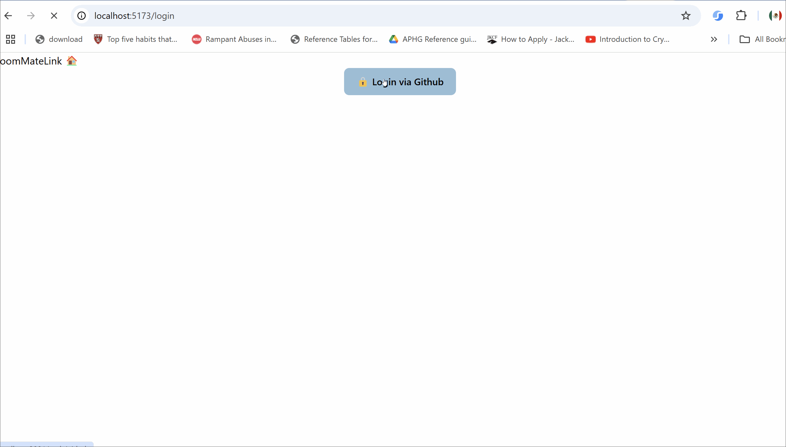
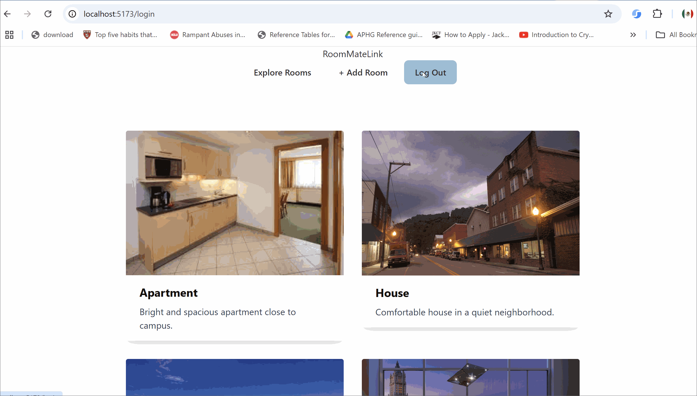
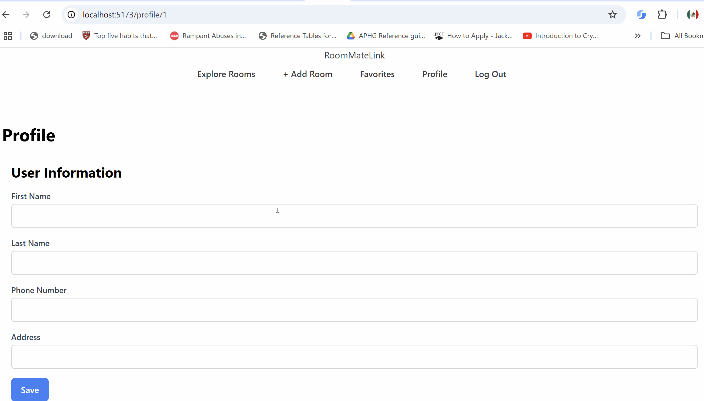

# RoomMateLink

CodePath WEB103 Final Project

Designed and developed by: Arely Martinez, Chau Anh Nguyen, Mary Ramirez

🔗 Link to deployed app:

## About

### Description and Purpose

RoomMateLink is a roommate matching platform designed specifically for students seeking affordable and convenient housing solutions. The app allows users to post and manage room rental listings, enabling landlords (students with available rooms) to connect with potential tenants (other students) in their area.

The main purpose of RoomMateLink is to simplify the process of finding suitable roommates and available rooms through an intuitive and user-friendly platform. By making these connections easier, the app empowers students to navigate their housing options with confidence.

### Inspiration

The inspiration for this app came from our own struggles with finding student housing. Like many others, we faced the challenge of securing a place that fit our budget, was in a good location, and matched our living preferences. Seeing how common this problem was among students, We wanted to create a solution that would make the process easier. By providing a dedicated platform where students can not only post and browse available rooms but also find roommates who share their schedules and lifestyles, this app aims to take the stress out of student housing.

## Tech Stack

Frontend: React.js

Backend:Node.js, Express.js, PostgreSQL

## Features

### User Sign Up✅

Users can create a new account by providing the github username and password.


### User Login ✅

Users can securely log into their accounts to view room listings, manage their profiles, and post new listings.



### User Logout ✅

Users can log out with one click to ensure their information remains secure.



### Create User Profile ✅

Users can set up personal profiles to provide information about themselves.



### Toast Messages ✅

Toast messages after the user creates a room listing, update their profile, update and delete a room.


### Room Rental Listing Management ✅

Users can create, modify, and remove room rental listings easily. They can post new listings, edit existing ones to update details like price or description, and delete listings once the room is rented.


### Browse Available Room Listings ✅

Users can view a list of all available room rentals on the platform.


### Filter Room Listings by Price and Location✅

Users can apply filters to narrow down their search results based on preferences.


### Save Favorite Listings ✅

Users can bookmark listings for easy access later.


### View Detailed Listing Information ✅

Users can click on listings to see in-depth information, including images, descriptions, price, and contact information.


## Installation Instructions

1. Clone the repository:

   ```bash
   git clone https://github.com/arelymartinez16/web103_finalproject.git
   ```

2. Navigate to the project directory:

   ```bash
   cd web103_finalproject
   ```

3. Install dependencies:

   ```bash
   npm install
   ```

4. Set up your environment variables:

   - Create a `.env.local` file in the `server` directory with your API keys and database credentials.
   - Example `.env.local` for the server:

     ```env
      PGUSER=""
      PGHOST= ""
      PGPASSWORD=""
      PGPORT= ""
      PGDATABASE=""


      GITHUB_CLIENT_ID= ""
      GITHUB_CLIENT_SECRET= ""
      SESSION_SECRET= ""
     ```

5. Start the application:

   - To start the server:

     ```bash
     npm start
     ```

     This will run the server in development mode at `http://localhost:3001`.

   - To start the client (from the `client` directory):
     ```bash
     npm run dev
     ```
     This will run the front-end app in development mode at `http://localhost:5173`.
